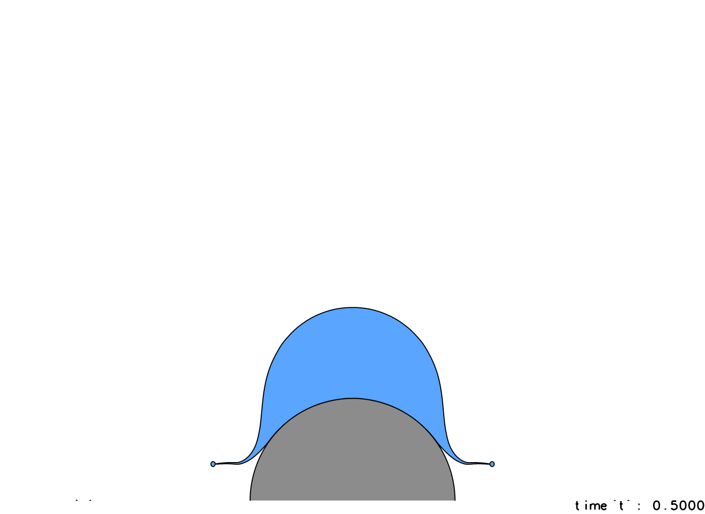
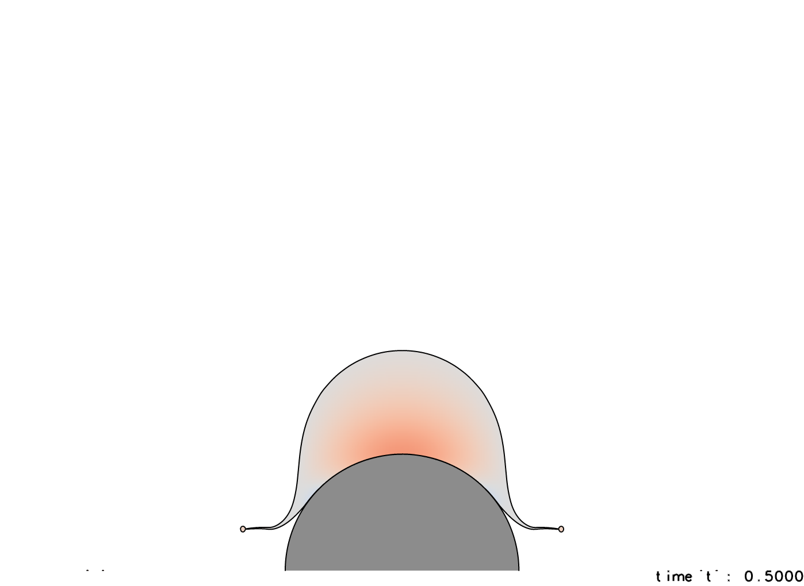

# Impact of drop on a spherical target

Basilisk C source files for numerical work on drop impact and target curvature. The solver uses a two-dimensional axisymmetric, incompressible two-phase formulation with volume-of-fluid (VOF) interface tracking, an embedded solid boundary, surface tension, gravity, and adaptive mesh refinement.

## Visualization snapshots

Drop-impact views at **t* = 0.50**.

| Drop shape | Pressure inside the droplet |
| --- | --- |
|  |  |

## Current repository status

The case currently included on `main` is the **flat-target, zero-curvature reference configuration**, labelled `Vel5.00_0_degree`. Both the simulation and visualization programs construct a plane normal to the symmetry axis.

## Repository contents

| File | Purpose |
| --- | --- |
| `Bdropimpact.c` | Axisymmetric drop-impact driver, embedded-wall setup, mesh adaptation, snapshots, and diagnostics |
| `constants.h` | Case inputs, nondimensionalization, solver includes, and output names |
| `stage_b_contact_grid.h` | Contact-cell reconstruction and embedded height-function integration |
| `stage_b_contact_tension.h` | Contact-region surface-tension treatment |
| `stage_b_geometry.c`, `stage_b_geometry.h` | Two-dimensional contact-geometry routines and declarations |
| `stage_b_huang_embed_curvature.h` | Wrapper for the external embedded-curvature implementation |
| `LaptopMPIV0.sh` | Local MPI compilation and launch script |
| `compile_Basilisk.sh` | Cluster-specific MPI compilation script |
| `ClusterMPI.sh` | Slurm job script for a precompiled executable |
| `BpostBview.c`, `Bview.sh` | Snapshot visualization and image/movie output |

## Model and default case

The axial coordinate is `x`; the radial coordinate is `y ≥ 0`, with the symmetry axis at `y = 0`. The drop initially moves in the negative axial direction toward a stationary, no-slip embedded plane.

Case inputs are defined in the `USER INPUT` sections of `constants.h`. In the default dimensional-input mode (`'d'`), SI reference values determine the dimensionless groups; the solver itself advances nondimensional fields with drop diameter, impact speed, and liquid density normalized to one. Length and time scales are `D` and `D/U0`.

| Input | Default |
| --- | --- |
| Drop diameter, `D` | 2.050 mm |
| Impact speed, `U0` | 5.00 m/s |
| Liquid / gas density | 998.0 / 1.21 kg/m³ |
| Liquid / gas dynamic viscosity | 0.001 / 1.81 × 10⁻⁵ Pa·s |
| Surface tension | 0.073 N/m |
| Gravity | 9.81 m/s² |
| Liquid contact angle | 90° |
| Meridional domain width | `4D` |
| Initial drop–surface gap | `0.04D` |
| Minimum / maximum refinement level | 9 / 12 |
| Duration after nominal contact | `2D/U0` |
| Snapshot interval | `0.01D/U0` |

The adaptive timestep is selected by Basilisk. The snapshot interval is an output setting, not a fixed solver timestep.

## Preparing and running a case

Requirements are [Basilisk](https://basilisk.fr/) with `qcc`, a C99-compatible MPI compiler and runtime, Bash, and the missing contact-line dependencies noted above. Visualization additionally uses [Basilisk's graphics libraries](https://basilisk.fr/src/gl/INSTALL); `Bview.sh` links against `glutils` and `fb_tiny`.

Before running:

1. Supply the matching contact-line dependency directories and verify their versions.
2. Review the input sections in `constants.h` and preserve the documented solver/include ordering.
3. Use a separate case directory to avoid overwriting outputs.
4. Match the local scripts' directory convention: they expect the enclosing folders to produce the same identifier as `CASE_ID`. With the defaults, this is `Vel5.00/0_degree/`.

Once those requirements are met, the supplied local workflow is:

```bash
bash LaptopMPIV0.sh
bash Bview.sh
```

`LaptopMPIV0.sh` compiles and launches with six MPI processes by default. `Bview.sh` renders snapshots from nondimensional time 0 to 1 in increments of 0.01.

For Slurm, adapt the hard-coded environment paths, modules, partition, and resource requests in `compile_Basilisk.sh` and `ClusterMPI.sh` to the target cluster. The compilation script creates `Bdropimpact`; the job script launches that executable with `srun`.

These workflows describe the supplied scripts. A successful build and run cannot be reproduced from this checkout alone while the required headers are absent.

## Outputs

With the default case identifier, the source writes:

- `intermediate/snapshot-*`: native Basilisk snapshots, named by nondimensional simulation time
- `lastfile`: latest saved solver state
- `parameters_Vel5.00_0_degree.txt`: resolved case inputs and dimensionless groups
- `energy_Vel5.00_0_degree.txt`: energy-related diagnostics
- `duration_Vel5.00_0_degree-CPU*.plt`: per-rank runtime records
- `endofrun_Vel5.00_0_degree-CPU*.txt`: per-rank completion records

The visualization program writes PNG frames under `bviewfiles_Vel5.00_0_degree/` and a movie named `Bview_Vel5.00_0_degree.mp4`.
